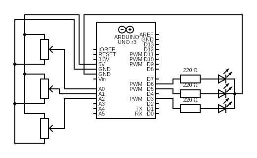
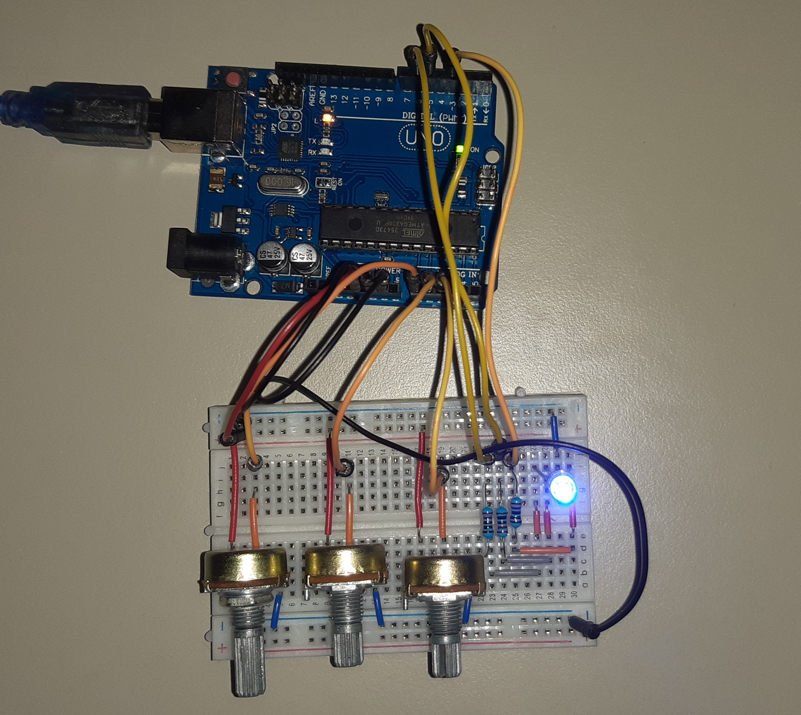
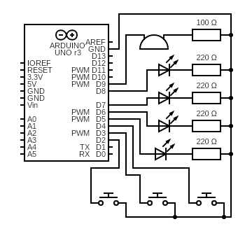
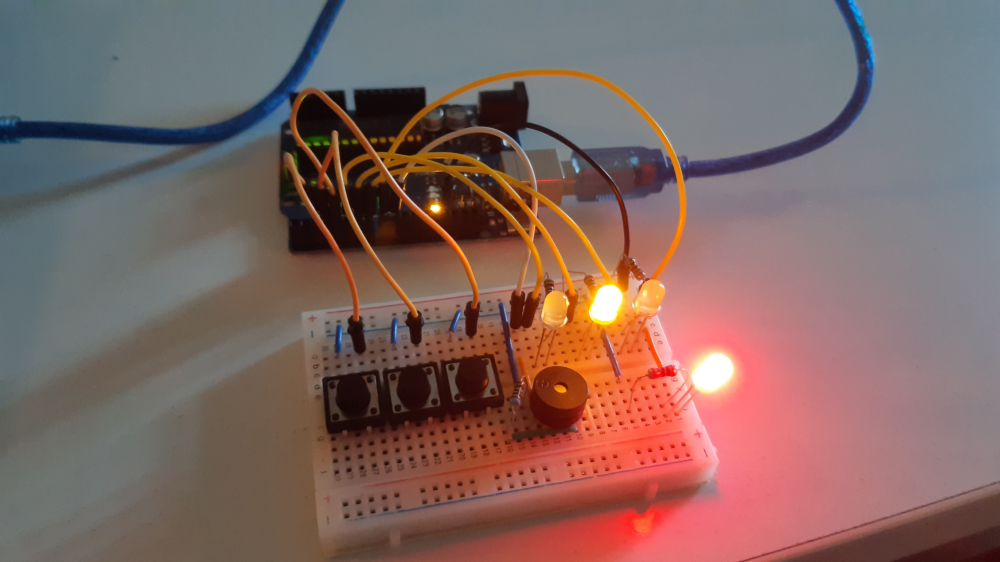
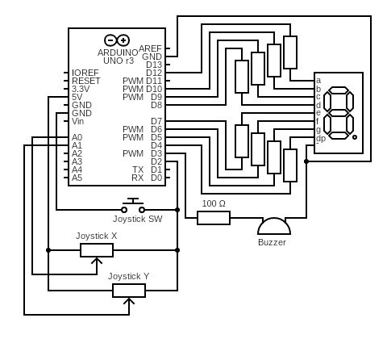
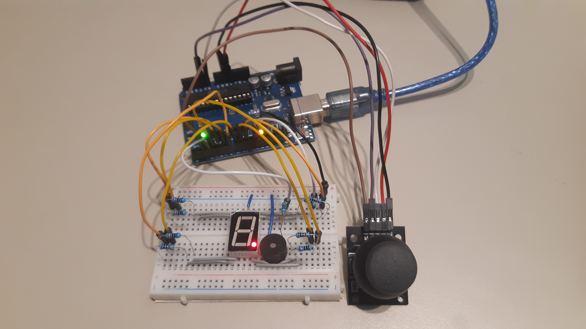

# Introduction to Robotics (2023 - 2024)

This repository contains laboratory homeworks for the Introduction to Robotics course taken at Faculty of Mathematics and Computer Science, University of Bucharest (1st semester, 3rd year).

The objective of the course is to learn to program a microcontroller and interface it with with hardware inputs and outputs in order to create functional and meaningful implementations of the core concepts.

The microcontroller used for the homeworks is an [Arduino Uno R3](https://docs.arduino.cc/hardware/uno-rev3). The code is written using [Arduino IDE](https://docs.arduino.cc/software/ide-v2) and the circuit schematics are created using [Circuit Diagram](https://www.circuit-diagram.org/).

Each homework includes all the code and schematics used in solving the homework, as well as code documentation and pictures and videos showcasing the final result.

## Contents

- [Homework 1: RGB LED](#homework-1-rgb-led)
- [Homework 2: Elevator simulator](#homework-2-elevator-simulator-wannabe)
- [Homework 3: 7 segment display drawing](#homework-3-7-segment-display-drawing)

## Homework 1: RGB LED

### Task description

The objective of this homework is to digitally control the red, green and blue light intensities of a RGB LED using 3 potentiometers.

### Components used

- Arduino UNO
- 3 potentiometers
- 1 RGB LED
- 3 220 ohm resistors
- connection wires.

### Circuit diagram

The diagram of the circuit is the following:

The value pin of the potentiometers are connected to analog inputs on the Arduino board (`A0` for red, `A1` for green `A2` for blue). The cathodes of the _RGB LED_ are connected to the _PWM_ pins 3, 5 and 6 on the board. The LED connections require a resistor. The input for each potentiometer is connected to _5V_ and all components are connected to ground.

### Code description

The code can be found in `src/homework01/`. Constant definitions can be found at the beginning of the file (such as the pin numbers for the inputs and outputs and maximum values for the analog input and output).

The `setup()` function initializes the digital pins in output mode and setups the serial communication (for debugging messages).

The `loop()` function reads the input values (one for each color: red, green, blue) from the potentiometer and outputs them to the LED output pins. Because the inputs are in range `[0, 1023]` and the output must be in range `[0, 255]`, I've used the `map()` function to map the input value to the corect range for the output value.

Because the value readings were flickering quite a bit, I've used the average reading over a number of measurements in order to compute the LED output intensity. There are constants defined which set how many measurements to take into account for the average, and the delay between measurements.

### Implementation demo
**Circuit implementation**

**Video demo**

[https://www.youtube.com/watch?v=vWhn9H-_sig](https://www.youtube.com/watch?v=vWhn9H-_sig)

## Homework 2: Elevator simulator wannabe

### Task description

The objective of the homework is to simulate the state behaviour of an elevator, using buttons to call the elevator to a floor and status LEDs and a buzzer to indicate elevator state. The elevator can be one of the states: Idle, Moving, Doors closing or Doors opening. The status LED blinks when the elevator is in movement and the floor indicator LEDs change state according to the current floor. A specific sound is played when the doors close, open or the elevator reaches a new floor.

### Components used

- Arduino UNO
- 3 push buttons
- 4 LEDs
- 4 220ohm resistors and 1 100ohm resistor
- buzzer
- connection wires

### Circuit diagram

### Code description

The code can be found in `src/homework02/`. Constant definitions can be found at the beginning of the file (such as the pin numbers for the inputs and outputs, action timings, the tone sequences). There are also defined variables for keeping program state and debounce timings. The button and LED pins and states are defined using arrays, which makes it easy to extend the program for an elevator with more floors. Tone sequences are defined as arrays of Notes (which include the frequency and duration of the tone).

The `setup()` function initializes pins and sets the first floor indicator as on.

The `loop()` function implements a state machine for the elevator, keeping track of the current state and state transitions. In order to make the code simpler, I've split the functionality in multiple functions.

The `delayedExec()` and `elevatorButtonPressed()` helper functions contain the logic for executing code only when a predefined interval elapsed using `millis()` and storing the previous `millis()` into a variable. Essentially they are replacements for using `delay()` without blocking the main loop.

The `callElevator()`, `elevatorStartMovement()` and `elevatorMovement()` action function define the behaviour when an action hapens. Call elevator is called on button press and starts the elevator movement if the right conditions are met. `elevatorStartMovement()` starts the movement transition, first waiting for the doors to close. `elevatorMovement()` handles the actions to be taken when the elevator reaches a new floor.

The `updateElevatorStatusIndicator()` functions handles status LED blinking when the elevator is moving.

The `playToneSequence()` and `asyncToneSequence()` functions handle tone sequence playing without delays. The array of notes is stored into a pointer and using `millis()` the next note is played only when the current note duration has elapsed.

### Implementation demo
**Circuit implementation**

**Video demo**
[https://www.youtube.com/watch?v=ePu1kwLA3go](https://www.youtube.com/watch?v=ePu1kwLA3go)

## Homework 3: 7 segment display drawing

### Task description

The objective of the homework is to control the state of a 7 segment digit display using joystick movement and switch press inputs. Additionally, I've added a buzzer for sound feedback of the state changes.

### Components used

- Arduino UNO
- a 7 segment digit display
- joystick
- buzzer
- 8 220ohm resistors and 1 100ohm resistor
- connection wires

### Circuit diagram

### Code description

The code can be found in `src/homework03/`. Constant definitions can be found at the beginning of the file (such as the pin numbers for the inputs and outputs, action timings, the tone sequences, and common annode / cathode configuration for 7 segment display). There are also defined variables for keeping program state and debounce timings. The 7 segment display pins and states are defined using arrays. Tone sequences are defined as arrays of Notes (which include the frequency and duration of the tone).

The `setup()` function initializes pins and registers the joystick switch state change interrupt handler. Because I want to catch both _pressed_ and _released_ states, I set the interrupt mode to `CHANGING`.

The `loop()` function processes input changes and triggers the respective actions. After that the display is updated to reflect the state changes. In order to make the code simpler, I've split the functionality in multiple functions.

The `resetAction()`, `toggleSegmentAction()` and `changeCurrentSegmentAction()` action handlers contain the logic of processing their respective actions. `resetAction()` resets the display and sets the current active segment to _DP_, `toggleSegmentAction()` flips the state of the active segment and `changeCurrentSegmentAction()` applies the transition matrix to determine the next active segment. All actions have an associated tone sequence that is played for sound feedback.

The `handleButtonInterrupt()` ISR function handles joystick switch debouncing using interrupts. When a state is changed and remains stable over the debounce period, the `buttonState` volatile variable is updated to reflect the state change. After the main loop reads the changed value it sets it to `UNCHANGED` so that it knows that the state change has been processed.

The `processButtonAction()` and `processJoystickMovement()` input handlers process the state and input value changes and return the action that is triggered by current state conditions. For the button long press, a timer is started on button press that either is stopped if button is released before reaching the configured long press interval or triggers the long press action when the timer exceeds the long press interval. For joystick movement, only changes from NEUTRAL to either direction or joystick return to NEUTRAL trigger a state change action.

The `updateDisplayState()` function keeps the display in sync with the state in memory. `blinkActiveSegment()` toggles the active state at a configured time interval and `resetBlinkActiveSegment()` resets the blink state (used when an action has been triggered).

`delayedExec()` is a helper function for asynchronous delayed code executions, implemented as in the previous homework. `playToneSequence()` and `asyncToneSequence()` are used for asynchronous tone sequence playing and are implemented as in the previous homework.

### Implementation demo
**Circuit implementation**

**Video demo**
[https://www.youtube.com/watch?v=_RZdfk5xklA](https://www.youtube.com/watch?v=_RZdfk5xklA)
