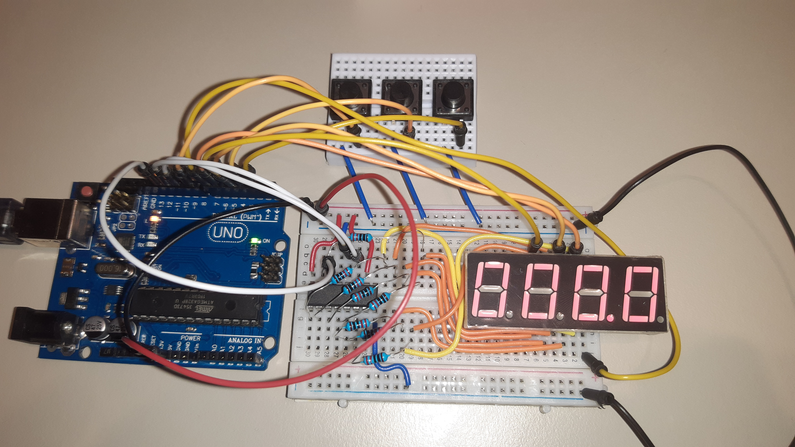
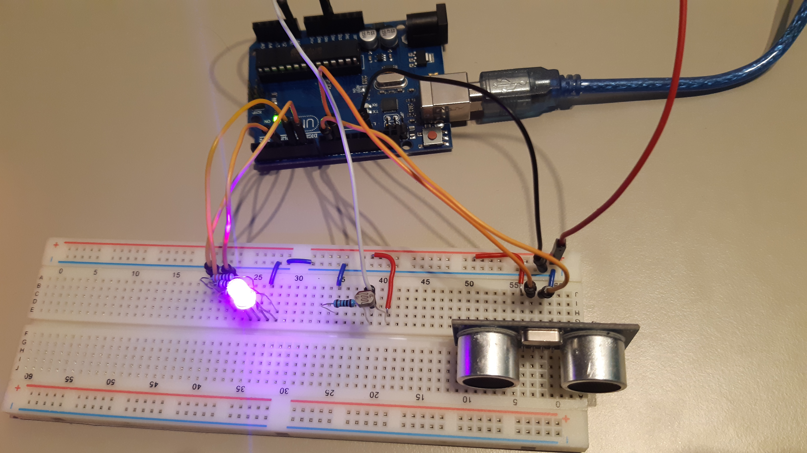

# Introduction to Robotics (2023 - 2024)

This repository contains laboratory homeworks for the Introduction to Robotics course taken at Faculty of Mathematics and Computer Science, University of Bucharest (1st semester, 3rd year).

The objective of the course is to learn to program a microcontroller and interface it with with hardware inputs and outputs in order to create functional and meaningful implementations of the core concepts.

The microcontroller used for the homeworks is an [Arduino Uno R3](https://docs.arduino.cc/hardware/uno-rev3). The code is written using [Arduino IDE](https://docs.arduino.cc/software/ide-v2) and the circuit schematics are created using [Circuit Diagram](https://www.circuit-diagram.org/).

Each homework includes all the code and schematics used in solving the homework, as well as code documentation and pictures and videos showcasing the final result.

## Contents

- [Homework 1: RGB LED](#homework-1-rgb-led)
- [Homework 2: Elevator simulator](#homework-2-elevator-simulator-wannabe)
- [Homework 3: 7 segment display drawing](#homework-3-7-segment-display-drawing)
- [Homework 4: Stopwatch timer](#homework-4-stopwatch-timer)
- [Homework 5: Pseudo-smart environment monitor and logger](#homework-5-pseudo-smart-environment-monitor-and-logger)
- [Homework 6: Mini Matrix Game](#homework-6-mini-matrix-game)

## Homework 1: RGB LED

### Task description

The objective of this homework is to digitally control the red, green and blue light intensities of a RGB LED using 3 potentiometers.

### Components used

- Arduino UNO
- 3 potentiometers
- 1 RGB LED
- 3 220 ohm resistors
- connection wires.

### Circuit diagram

The diagram of the circuit is the following:

The value pin of the potentiometers are connected to analog inputs on the Arduino board (`A0` for red, `A1` for green `A2` for blue). The anodes of the _RGB LED_ are connected to the _PWM_ pins 3, 5 and 6 on the board. The LED connections require a resistor. The input for each potentiometer is connected to _5V_ and all components are connected to ground.

### Code description

The code can be found in `src/homework01/`. Constant definitions can be found at the beginning of the file (such as the pin numbers for the inputs and outputs and maximum values for the analog input and output).

The `setup()` function initializes the digital pins in output mode and setups the serial communication (for debugging messages).

The `loop()` function reads the input values (one for each color: red, green, blue) from the potentiometer and outputs them to the LED output pins. Because the inputs are in range `[0, 1023]` and the output must be in range `[0, 255]`, I've used the `map()` function to map the input value to the corect range for the output value.

Because the value readings were flickering quite a bit, I've used the average reading over a number of measurements in order to compute the LED output intensity. There are constants defined which set how many measurements to take into account for the average, and the delay between measurements.

### Implementation demo
**Circuit implementation**

**Video demo**

[https://www.youtube.com/watch?v=vWhn9H-_sig](https://www.youtube.com/watch?v=vWhn9H-_sig)

## Homework 2: Elevator simulator wannabe

### Task description

The objective of the homework is to simulate the state behaviour of an elevator, using buttons to call the elevator to a floor and status LEDs and a buzzer to indicate elevator state. The elevator can be one of the states: Idle, Moving, Doors closing or Doors opening. The status LED blinks when the elevator is in movement and the floor indicator LEDs change state according to the current floor. A specific sound is played when the doors close, open or the elevator reaches a new floor.

### Components used

- Arduino UNO
- 3 push buttons
- 4 LEDs
- 4 220ohm resistors and 1 100ohm resistor
- buzzer
- connection wires

### Circuit diagram

### Code description

The code can be found in `src/homework02/`. Constant definitions can be found at the beginning of the file (such as the pin numbers for the inputs and outputs, action timings, the tone sequences). There are also defined variables for keeping program state and debounce timings. The button and LED pins and states are defined using arrays, which makes it easy to extend the program for an elevator with more floors. Tone sequences are defined as arrays of Notes (which include the frequency and duration of the tone).

The `setup()` function initializes pins and sets the first floor indicator as on.

The `loop()` function implements a state machine for the elevator, keeping track of the current state and state transitions. In order to make the code simpler, I've split the functionality in multiple functions.

The `delayedExec()` and `elevatorButtonPressed()` helper functions contain the logic for executing code only when a predefined interval elapsed using `millis()` and storing the previous `millis()` into a variable. Essentially they are replacements for using `delay()` without blocking the main loop.

The `callElevator()`, `elevatorStartMovement()` and `elevatorMovement()` action function define the behaviour when an action hapens. Call elevator is called on button press and starts the elevator movement if the right conditions are met. `elevatorStartMovement()` starts the movement transition, first waiting for the doors to close. `elevatorMovement()` handles the actions to be taken when the elevator reaches a new floor.

The `updateElevatorStatusIndicator()` functions handles status LED blinking when the elevator is moving.

The `playToneSequence()` and `asyncToneSequence()` functions handle tone sequence playing without delays. The array of notes is stored into a pointer and using `millis()` the next note is played only when the current note duration has elapsed.

### Implementation demo
**Circuit implementation**

**Video demo**
[https://www.youtube.com/watch?v=ePu1kwLA3go](https://www.youtube.com/watch?v=ePu1kwLA3go)

## Homework 3: 7 segment display drawing

### Task description

The objective of the homework is to control the state of a 7 segment digit display using joystick movement and switch press inputs. Additionally, I've added a buzzer for sound feedback of the state changes.

### Components used

- Arduino UNO
- a 7 segment digit display
- joystick
- buzzer
- 8 220ohm resistors and 1 100ohm resistor
- connection wires

### Circuit diagram

### Code description

The code can be found in `src/homework03/`. Constant definitions can be found at the beginning of the file (such as the pin numbers for the inputs and outputs, action timings, the tone sequences, and common annode / cathode configuration for 7 segment display). There are also defined variables for keeping program state and debounce timings. The 7 segment display pins and states are defined using arrays. Tone sequences are defined as arrays of Notes (which include the frequency and duration of the tone).

The `setup()` function initializes pins and registers the joystick switch state change interrupt handler. Because I want to catch both _pressed_ and _released_ states, I set the interrupt mode to `CHANGING`.

The `loop()` function processes input changes and triggers the respective actions. After that the display is updated to reflect the state changes. In order to make the code simpler, I've split the functionality in multiple functions.

The `resetAction()`, `toggleSegmentAction()` and `changeCurrentSegmentAction()` action handlers contain the logic of processing their respective actions. `resetAction()` resets the display and sets the current active segment to _DP_, `toggleSegmentAction()` flips the state of the active segment and `changeCurrentSegmentAction()` applies the transition matrix to determine the next active segment. All actions have an associated tone sequence that is played for sound feedback.

The `handleButtonInterrupt()` ISR function handles joystick switch debouncing using interrupts. When a state is changed and remains stable over the debounce period, the `buttonState` volatile variable is updated to reflect the state change. After the main loop reads the changed value it sets it to `UNCHANGED` so that it knows that the state change has been processed.

The `processButtonAction()` and `processJoystickMovement()` input handlers process the state and input value changes and return the action that is triggered by current state conditions. For the button long press, a timer is started on button press that either is stopped if button is released before reaching the configured long press interval or triggers the long press action when the timer exceeds the long press interval. For joystick movement, only changes from NEUTRAL to either direction or joystick return to NEUTRAL trigger a state change action.

The `updateDisplayState()` function keeps the display in sync with the state in memory. `blinkActiveSegment()` toggles the active state at a configured time interval and `resetBlinkActiveSegment()` resets the blink state (used when an action has been triggered).

`delayedExec()` is a helper function for asynchronous delayed code executions, implemented as in the previous homework. `playToneSequence()` and `asyncToneSequence()` are used for asynchronous tone sequence playing and are implemented as in the previous homework.

### Implementation demo
**Circuit implementation**

**Video demo**
[https://www.youtube.com/watch?v=_RZdfk5xklA](https://www.youtube.com/watch?v=_RZdfk5xklA)

## Homework 4: Stopwatch timer

### Task description

The objective of the homework is to create a simple stowpatch timer with lap recording functionality using a 4 digit 7 segment display. Also, in order to have fewer arduino connections, the display output is controlled through a shfit register.

### Components used

- Arduino UNO
- a 4 digit 7 segment digit display
- a SN74HC595 shift register
- 3 button switches
- 8 220ohm resistors
- connection wires

### Circuit diagram

### Code description

The code can be found in `src/homework04/`. Constant definitions can be found at the beginning of the file (such as the pin numbers for shift register outputs, action button inputs and display control pins, action timings, common annode / cathode configuration for 7 segment display and the max length of the lap vector). There are also defined variables for keeping program state and button press debounce timings. The stopwatch can be in one of these states: _STOPPED_, _RUNNING_, _PAUSED_. In _STOPPED_ state, the stopwatch can be started (state changing to _RUNNING_), or cycle through saved laps. In _RUNNING_ state, the count is incremented, current count can be saved as laps and the count can be paused (state changing to _PAUSED_). In _PAUSED_ state the count can be reseted (state changing to _STOPPED_) or the count can be resumed (state changing to _RUNNING_). While in _PAUSED_ state, the display blinks.

The `setup()` function initializes pins and registers the start / pause and lap button interrupt handlers triggered on `FALLING` pin state.

The `loop()` function processes input changes, increments the count, updates the blink state and updates the display to reflet state changes. In order to make the code simpler, I've split the functionality in multiple functions.

The `handleStartPauseButtonInterrupt()`, `handleLapButtonInterrupt()` and `handleResetButtonPress()` contain button press handling logic calling the respective action handlers depending on current state. The first two are interrupt handlers in order to achieve better time precision.

The `toggleStartPauseStopwatch()` action handler toggles between the _RUNNING_ and _PAUSED_ stopwatch states.

The `saveLapAction()` action handler saves the current count as a new lap. The `nextLapInsertIndex` variable is used to cycle around the index where the lap time is saved when the maximum length of the lap vector is exceeded.

The `cycleViewLapsAction()` action handler updates the `activeViewLapIndex` state to cycle around saved values. The first index provided corresponds to the oldest added value. When the index reaches the end of the lap vector, it cycles around to the beginning.

The `resetCountAction()` action handler switches to _STOPPED_ state and resets the count and the active view lap index.

The `resetLapsAction()` action handler resets the recorded laps.

The `displayNumber()` function along with `writeReg()` and `activateDisplay()` helper functions write a number to the 4 digit 7 segment display, using the shift register. `writeReg()` writes a binary encoding of the display pins (A, B, C, D, E, F, G, DP) to the register for the active display. Using `activateDisplay()`, all the 4 digits are written sequentially but fast enough so that they apear to be always on.

The `buttonInterruptDebounce()` and `buttonDebounce()` helper functions are used to identify debounced button presses inside interrupt handler or in the `loop()` function. They only return true when the debounced button state changed to pressed. The `delayedExec()` helper function handles the asyncrhonous delayed execution of code, returning true only when the specified interval has elapsed since last execution.

### Implementation demo
**Circuit implementation**

**Video demo**
[https://www.youtube.com/watch?v=vgNZHsnJdfU](https://www.youtube.com/watch?v=vgNZHsnJdfU)

## Homework 5: Pseudo-smart environment monitor and logger

### Task description

The objective of this homework is to create a sensor monitor and logger which can be controlled unsing serial communication between the computer and the Arduino board. Using serial inputs and outputs, a console interface is presented to the user, who can navigate through menus to see the current sensor values and the last 10 logged values and can change sensor alert thresholds. The monitoring component consists of changing the color of a RGB LED when the sensor values are below the configured thresholds. Moreover, the settings are saved on EEPROM and can be restored at launch. The RGB LED color can either be controlled automatically (if a sensor alert has been triggered is red, otherwise green), or manually, specifing a value for each of the red, green and blue channels. The sensors used are the ultrasonic sensor for distance measuring and the LDR sensor, to detect ambiental light brightness.

### Components used

- Arduino UNO
- HC-SR04 ultrasonic sensor
- LDR sensor
- RGB LED
- 3 220ohm resistors and one 10k ohm resistor
- connection wires

### Circuit diagram

### Code description

The code can be found in `src/homework05/`, where the program file is split into sections with comments detailing each function.

**Menu handling**\
In order to make the code easier to reuse and extend, I've generalized the functionality of the menu. Each menu and submenu in the app is found in the `menus` vector and is represented by the `Menu` struct. Their indexes in the vector are also aliased by the `AppMenus` enum for easier access. Each menu contains its title and a vector of menu options (along with the vector length). Each menu option contains its label (that is shown to the user) and the action that is triggered by selecting the menu (and optionally additional information for the action handler). 

The actions available are specified in the `MenuAction` enum, and for this program they are: `CHANGE_MENU`, `MENU_BACK`, `CHANGE_INPUT_CONTEXT`, `DISPLAY_LAST_READINGS`, `DISPLAY_CURRENT_SETTINGS`, `TOGGLE_LED_AUTO_MODE`. The menu action handler (`processMenuAction()`) calls the apropiate handler based on the action selected. `CHANGE_MENU` and `MENU_BACK` are related to the menu navigation, and push or pop a menu to / from the menu stack.

The application menu system works using a menu stack. When selecting a menu option which leads to a submenu (`CHANGE_MENU` action), the nesting level is increased and the selected submenu is added to the stack. When selecting the back option (`MENU_BACK` action, which is added automatically for all menus with nesting larger than 0), the current menu is popped from the stack and the nesting level is decreased. The main menu should always be the bottom of the stack and cannot be popped. `getCurrentMenu()` returns the top of the stack, which is the current menu.

Integrated with the input context handling routine, the current menu is displayed (`printCurrentMenu()`) along with a prompt which tels the user to select one of the available menu options. If the value inputed is incorect, it is ignored and a warning is showed to the user to input a correct selection. This is handled by `processMenuInput()` function.

**Input context handling**\
The input context is used to identify how the data that is received from serial input should be interpreted. Based on the current input context, the right handler is used to process the input and update the app state (`processInput()` function). The input prompt is displayed in the console to let the user know what data does the program expect (`printInputPrompt()`). When the context input is `MENU_SELECTION`, the current menu is also displayed. The input contexts defined in this program are:

- `MENU_SELECTION` (menu navigation)
- `SAMPLING_RATE` (configure the sampling rate)
- `ULTRASONIC_THRESHOLD` (configure ultrasonic sensor min alert threshold)
- `LDR_THERSHOLD` (configure the LDR sensor min alert threshold)
- `RESET_ULTRASONIC_LOGS_CONFIRM` (confirm the reset of ultrasonic data logs)
- `RESET_LDR_LOGS_CONFIRM` (confirm the reset of LDR data logs)
- `READINGS_DISPLAY` (used to exit the continuous display of the current sensor readings)
- `RGB_LED_VALUE` (configure the RGB LED manual color).

Data input is implemented using an input buffer. The characters received from the serial input are appended to the input buffer until either a newline character (\n or \r) is reaced
or the buffer reaches its maximum length. When that happens, the current input context handler is executed to process the input buffer. This logic is handled by `receiveSerial()` function. There is also the `inputParseInt()` utility function, which helps to get an int value from input buffer.

The current input context is changed by a menu option with the `CHANGE_INPUT_CONTEXT` action, specifing in the data argument the index of the new input context. When the input context is resolved (the user entered valid input), the current input context returns to `MENU_SELECTION`.

**Data logging**\
The `SensorLog` structure is used to simplify the process of logging sensor data with cycling current index (when the maximum length of data vector is reached, the index starts again from 0 and replaces older values). It has 3 methods:

- `logValue(int value)` (which adds a new value to the log)
- `getLog(int index)` (which gets a logged value, index 0 meaning the oldest logged value)
- `resetLogs()` (the logged data is reset)

This class is used to store ultrasonic and LDR sensors data, and reset the logs independently from one another.

**Input handlers**\
The input handlers: `processSamplingRateInput()`, `processUltrasonicThresholdInput()`, `processLDRThresholdInput()`, `resetUltrasonicLogs()`, `resetLDRLogs()` and `processRgbLedValueInput()`, process the input vector and validate the data received. If it is correct, their action is executed (i.e. the new configuration is updated and saved on _EEPROM_, or the logged data is reset). If the input validation fails, the input context handler is notified and an error message is displayed requesting valid input.

**RGB input**\
The RGB color for the LED is read as a string in the hex format (for example `#ffffff` is _white_ and represents the values `255, 255, 255` for the Red, Green and Blue channels). The RGB value input handler parses the input buffer and checks if the input is valid and converts from string into a long variable. When aplying the values to the LED or when displaying the current setting, the utility functions: `getRedValue()`, `getGreenValue()`, `getBlueValue()`, use bitwise operations to extract the value for their respective color channel.

The pins for LED control are PWM pins in order to have gradual control over the intensity of each color channel.

**Action handlers**\
Besides the `CHANGE_MENU`, `MENU_BACK` and `CHANGE_INPUT_CONTEXT` actions, there also are basic actions that display the data requested, implemented in the `printSensorSettings()` and `printLastLoggedData()` functions.

**Sensor reading and LED control**\
The `processSensors()` function, along with `readUltrasonicValue()` and `readLDRValue()` reads the values currently detected by the sensors and logs them. If the values are below the thresholds, a message is displayed for the user. `readUltrasonicValue()` uses the constant for the speed of sound to compute the distance based on the time it takes for the sensor to receive the echo of its pulse. The LDR sensor is a dynamic resistor, and its value is proportional to the ammount of light it receives.

### Implementation demo
**Circuit implementation**

**Video demo**
[https://www.youtube.com/watch?v=rAqru-DwZEE](https://www.youtube.com/watch?v=rAqru-DwZEE)

## Homework 6: Mini Matrix Game

### Task description

The objective is to implement a simple bomber-like game using the matrix display to show game state and the joystick to move the player around. The game matrix contains empty cells (off LEDs), walls (always on LEDs), the current player position (slowly blinking LED) and the bomb (rapidly blinking LED).

The goal of the game is to destroy all the walls by placing bombs. When the bomb goes off, the walls on the same row or column with the bomb are destroyed. If the player stays in the range of the bomb, loses the game. If all walls have been destroyed, the player wins the game.

### Components used

- Arduino UNO
- a 8x8 LED matrix display
- a joystick
- a button
- a MAX7219 LED driver IC
- a 10k ohm resistor
- connection wires

### Circuit diagram

The diagram of the circuit is the following:

The _MAX7219_ circuit (which is a LED driver) is used to manage the state of the LED matrix more easily. It manages internally the multiplexing and displaying each LED at a time at high refresh rate.

### Code description

The code can be found in `src/homework06/`. The code has been split into multiple classes for each module.

The `Joystick` and `Button` classes handle the _input_ processing for the joystick movement and trigger button press. The `DisplayMatrix` class handles the functionality to _output_ the game state to the matrix display and display static images. The `Game` class manages the game logic and actions. The utility function `delayedExec()` and constant definitions for static images are defined in their own header files.

By having modularized code, it is easier to follow and understand the program logic and it makes the code easier to extend.

**Joystick module**\
The code for the joystick module has been adapted from the [3rd homework](#homework-3-7-segment-display-drawing). It provides the following public members:

- `Joystick(const byte joystickPinX, const byte joystickPinY, const bool invertX, const bool intertY)`: constructor which configures the used pins and if the directions on X or Y axes are inverted
- `void setup()`: sets up the input pins (to be called in the main program `setup()` function)
- `bool processMovement()`: updates the current joystick position and returns true if the position changed
- `JoystickPosition getState()`: provides the current joystick position

**Button module**\
This module helps adding debounce to a _INPUT\_PULLUP_ button. It provides the following public members:

- `Button(const byte buttonPin)`: constructor which configures the button pin
- `void setup()`: sets up the input pin (to be called in the main program `setup()` function)
- `bool buttonPressed()`: returns true if the debounced state of the button just changed to pressed

**DisplayMatrix module**\
This module uses the [LedControl](https://wayoda.github.io/LedControl/) library to interface with the _MAX7219_ integrated circuit. It can either output the game state to the matrix display, or display static images (when a game is not running). It also keeps track of the blink states for bomb and player positions. It provides the following public members:

- `DisplayMatrix(const byte dinPin, const byte clockPin, const byte loadPin)`: constructor which configures the display pins
- `void setup()`: sets up the display (to be called in the main program `setup()` function)
- `void updateGameState(const Game &game)`: updates the display based on the current game state
- `void displayImage(uint64_t image)`: display static image
- `void resetPlayerBlink()` and `void resetBombBlink()`: reset the blink states

**Game module**\
This module manages the actual game logic. It contains the game logical matrix (which has the information about wall positions) and keeps track of the player and bomb positions.
The game state is updated by player movement and bomb placement actions. Random map generation and collision detection are also handled internally by this class. It provides the following public members:

- `void startGame()`: starts a new game with a random placement of walls and the player
- `bool playerMove(JoystickPosition pos)`: action to move the player in the direction indicated by joystick (returns true if the movement is possible)
- `void placeBomb(unsigned long time)`: action to place bomb on current player location
- `bool bombTick(unsigned long time)`: check if bomb timer expired, if so the bomb is exploded and state is updated (returns true if the bomb exploded)
- `CellType getCellType(Position pos)`: get information about a cell in the game map (used for displaying the game state to the LED matrix display)
- `GameState getState()`: get current game state

Besides the `Game` class, this module also defines helper types such as:

- `Position`: this struct keeps information about the row and column in the game matrix
- `CellType`: enum for the kinds of cells that can exist in the game matrix (_EMPTY_, _WALL_, _BOMB_ or _PLAYER_)
- `GameState`: enum for the state of the game (_NOT\_STARTED_, _RUNNING_, _LOST_, _WON_)
  Initially the state is _NOT\_STARTED_ and changes to _RUNNING_ after the `startGame()` method is called. When a bomb explodes, the game state can change into _LOST_ or _WON_.

**Main program**\
The main program contains only the constant definitions for board pins and the module objects.

The `setup()` function calls the `setup()` methods for all modules.

The `loop()` function handles the higher level app logic based on current game state.

Static images are outputed to the display at the program start (the play icon) and after the game ends (smiley face if the player won, or sad face if the player lost).

After the game finishes, the player can choose to play again by pressing the trigger button.

### Implementation demo
**Circuit implementation**

**Video demo**

[https://www.youtube.com/watch?v=Z9CGPHo4Sw4](https://www.youtube.com/watch?v=Z9CGPHo4Sw4)
